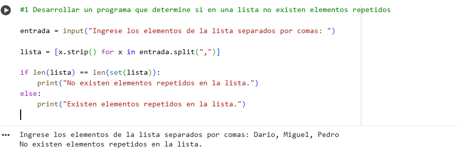
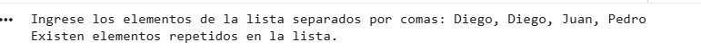
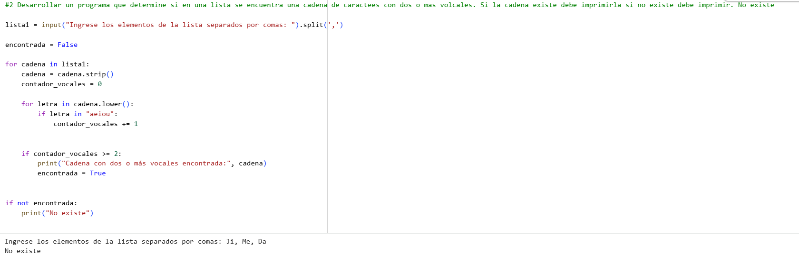
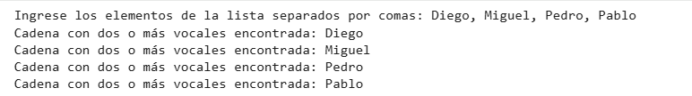
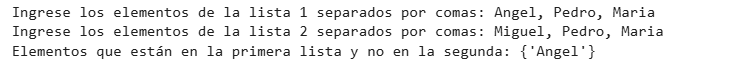
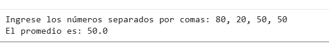

#1 Desarrollar un programa que determine si en una lista no existen elementos repetidos:

*Caso con palabra sin repetir  

*Caso con palabra repetida   

#2 Desarrollar un programa que determine si en una lista se encuentra una cadena de caractees con dos o mas volcales. Si la cadena existe debe imprimirla si no existe debe imprimir. 

*No existe  

*Existe  

#3 Desarrollar un programa que dadas dos listas determine que elementos tiene la primera lista que no tenga la segunda lista

#4 Desarrollar un algoritmo que calcule el promedio de un arreglo de reales

###Colab por si acaso https://colab.research.google.com/drive/1k_rQYJ0RQBIqveFKWmJMO66iVePGemVo?usp=sharing
